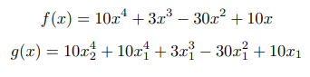
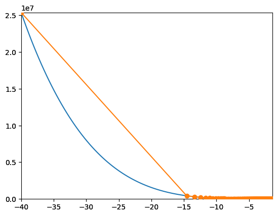
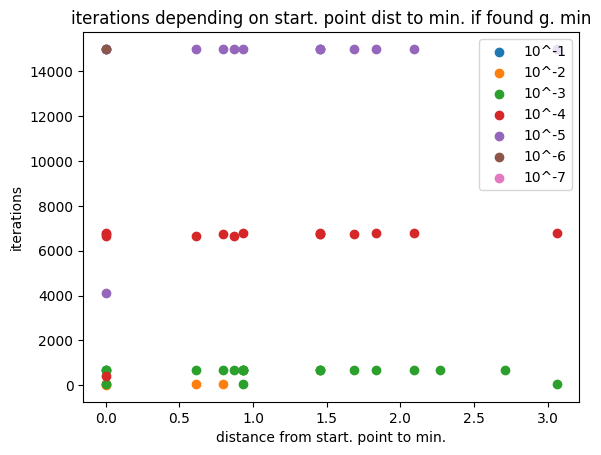
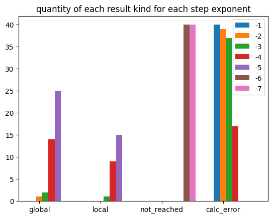

## Gradient descent implementation

Objectives of this assignment:
- plot functions
- find minimum with implemented gradient descent algorithm
- analyze impact of step size for random starting points

## lab1_v1
contains:
- algorithm implementation with gradient calculated by numdiftools
- cherry picking and visualization of subsequent points - which point where analyzed before finding minium
 

 ## lab1_v2
 contains:
- algorithm implementation with gradient given externally
- random tests - step size vs starting point
- plots for tests

